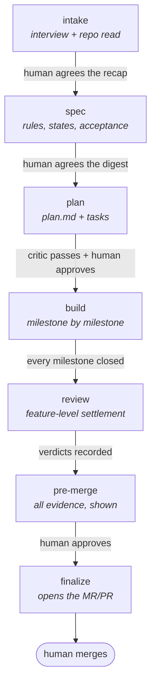

# legion

Legion runs a software feature end-to-end inside Claude Code — interview, spec, plan, build,
review, and finalize — with a human approving at every gate. It provides a small, zero-dependency
CLI (`legion`) that enforces typed operations and records evidence so operations are auditable
and fail closed when needed.

Requirements: Node >= 22.

## Install (recommended — GitHub)

```sh
claude plugin marketplace add rachiddaoud/legion
claude plugin install legion@legion
node ~/.claude/plugins/marketplaces/legion/bin/legion.mjs setup
```

These commands register the marketplace and install the plugin. Claude Code keeps a git clone at
`~/.claude/plugins/marketplaces/legion` (or `$CLAUDE_CONFIG_DIR/plugins/marketplaces/legion` if
you set `CLAUDE_CONFIG_DIR`) and will pull updates when auto-update is enabled.

To run from a local checkout:

```sh
cd <this repo> && ./bin/legion setup
```

## Update

Enable automatic updates once via `/plugin` → Marketplaces → *legion* or add to
`~/.claude/settings.json`:

```json
{
  "extraKnownMarketplaces": {
    "legion": {
      "source": { "source": "github", "repo": "rachiddaoud/legion" },
      "autoUpdate": true
    }
  }
}
```

Manual update:

```sh
claude plugin marketplace update legion && claude plugin update legion
```

## Start a feature

From a Claude Code session, in any repo:

```
/legion:start
```

This creates the worktree, branch and dossier and runs the feature session. To resume:

```
/legion:feature resume <feature-id>
```

## How it works (overview)

Legion drives features through a small typed kernel across seven stages. High-level flow:



Agents propose; the kernel records evidence and enforces safety gates. The intent is to keep operations auditable and fail closed rather than guessing.

## Day to day

- Reduce interactive prompts by allow-listing Claude commands you trust. Add common read-only `legion` commands to `~/.claude/settings.json` so Claude Code can run them without asking each time. Example:

```json
{
  "permissions": {
    "allow": [
      "Bash(legion state *)",
      "Bash(legion gate *)",
      "Bash(legion plan *)",
      "Bash(legion feature status*)",
      "Bash(legion doctor*)"
    ]
  }
}
```

Keep any write or destructive commands off the allow-list for safety.

- Install and authenticate your forge CLI. Legion uses the platform CLI for some operations (creating PRs, checking branch protection). For GitHub:

```sh
gh auth login
```

For GitLab:

```sh
glab auth login
```

Ensure the CLI is on your PATH so `legion` can call it.

- Run `legion doctor` to validate your environment. It checks common failure points (git, Node, PATH links, and forge CLI auth) and prints actionable remedies (for example: “install gh”, “run gh auth login”, or “npm rm -g legion if PATH links to the clone”).

## Quick reference

- Install: use the three commands in Install (recommended).
- Update: enable auto-update or run the manual update command.
- Start: run `/legion:start` in a Claude Code session.

For developer details and migration steps, see the repository history and PRs.
