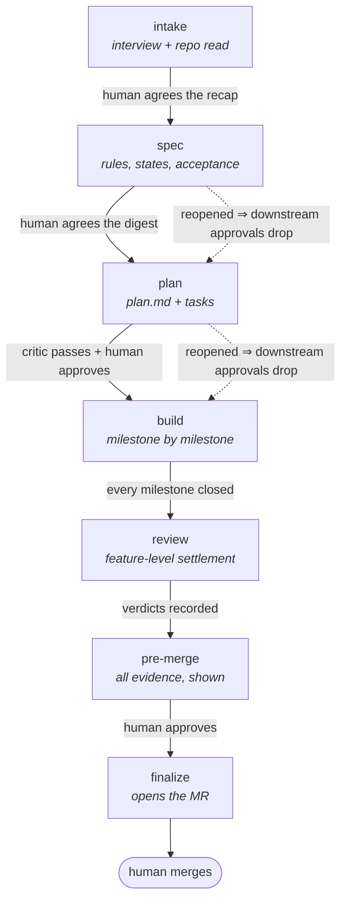
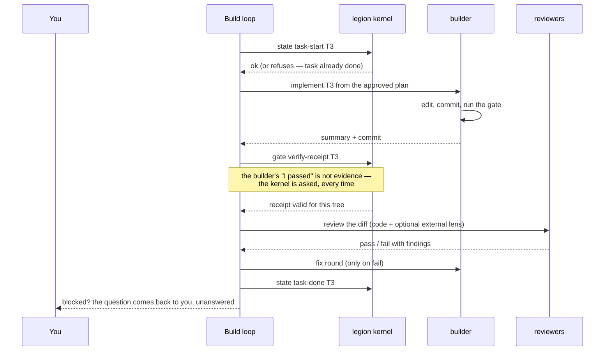

# legion

Legion runs a software feature end to end inside Claude Code — interview, spec, plan, build,
review, merge request — with a human approving at every gate that matters.

What makes it more than a long prompt: a small zero-dependency CLI kernel (`legion`) owns every
state change, every piece of evidence and every gate. Agents propose; the kernel decides. It
fails closed rather than guessing.

Plain ESM, Node >= 22, zero runtime dependencies. Distributed as a Claude Code plugin.

## Install

```sh
cd <this repo> && ./bin/legion setup
```

Registers this checkout as a Claude Code plugin marketplace, installs the plugin from it, puts
`legion` on your PATH, then runs `legion doctor`. **Re-run it after upgrading the checkout** —
the installed plugin is a snapshot, not a symlink.

## Start a feature

From a Claude Code session, in any repo:

```
/legion:start
```

That's it. It asks two or three questions (what the feature is, which branch it builds on, an
optional ticket), creates the worktree, branch and dossier, and keeps going as the feature
session — no second window, no launch command to copy. If legion has never seen this repository
it registers it for you first.

To come back to a feature later, from its worktree — or just paste the launch command legion
printed when it created the feature, which opens a session there for you:

```
/legion:feature resume <feature-id>
```

## How it works

Seven stages. Every arrow is a typed kernel operation, not a convention — and the ones that say
*human* do not move without you.



On **express**, the two top human stops collapse into one: the spec is a mini-spec whose
approval is fused into the intake recap, so `intake → spec → plan` moves on a single yes.

Approvals are bound to content, not to stages: edit an approved `plan.md` and its approval
drops automatically. That is the safety net, not a bug.

Inside the build stage, every task runs the same loop. Note who talks to the kernel, and what
the kernel refuses to take anyone's word for:



A builder that hits a real decision returns it as a question instead of guessing. You answer it,
and only that task retries.

## Profiles

Chosen at intake, escalated (never lowered) the moment evidence says so:

| Profile | Spec | Plan critic | Per-task review | Milestone product review | External second opinion |
|---|---|---|---|---|---|
| **express** | mini-spec, approval fused into the intake recap | skipped | one lens | no | no |
| **standard** (default) | full spec, own approval gate | yes | one lens, plan risk tiers honoured | yes | no |
| **full** | full spec, own approval gate | yes | three dimension lenses — correctness, tests, design — risk tiers ignored | yes | yes, advisory |

`full` is the profile that costs more on *any* machine: its per-task review is three reviewers with
narrow, disjoint mandates instead of one reviewer covering everything, and the plan's per-task risk
tiers — which buy review cheapness on the other profiles — are ignored. The external second opinion
(the `codex` CLI, at plan stage and each milestone close) is advisory on top of that, and simply
absent when the CLI is not installed.

## Day to day

**Fewer permission prompts.** A feature session calls the read-only kernel commands dozens of
times per stage. Allowlist them in `~/.claude/settings.json`:

```json
{
  "permissions": {
    "allow": [
      "Bash(legion state *)",
      "Bash(legion gate *)",
      "Bash(legion plan *)",
      "Bash(legion feature status*)",
      "Bash(legion doctor*)"
    ]
  }
}
```

Deliberately not on that list: `legion feature start|abandon|clean` and `legion finalize` — they
create, destroy, or write to the remote, and they stay rare enough to be worth a prompt.

**When something refuses:** `legion doctor` checks git, node, the home layout and branch
protection, and prints a remedy per probe.

**To watch what happened:** `/legion:viewer` opens a read-only dashboard over the manifests,
artifacts and feature git history. Legion behaves identically with it closed.

**To declare your real gate** (tests, lint) instead of the tier-0 default:
`legion project init --gates ./gates.json` — structured argv arrays only, never shell strings;
`--bootstrap ./bootstrap.json` does the same for per-worktree setup. Both file shapes are
documented in the header of `src/cli/project.mjs`, and a bad file dies naming the offending key.
